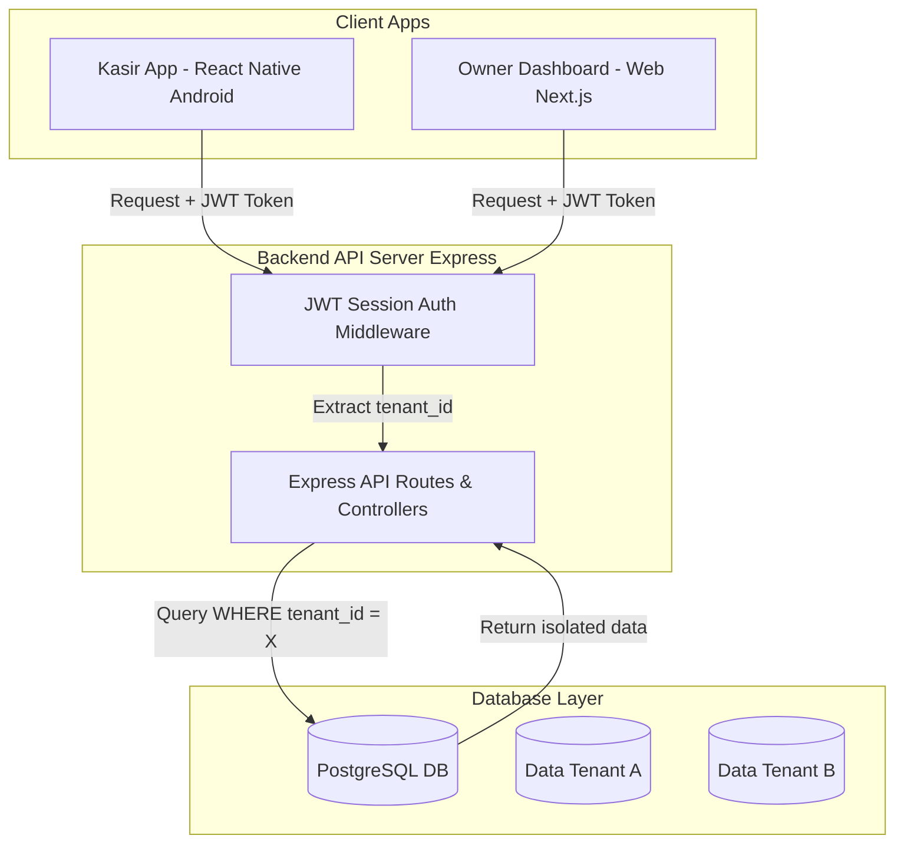

# Pilihan & Spesifikasi Tech Stack
## Aplikasi Laundry SaaS Multi-Tenant (MVP)

Dokumen ini menjabarkan spesifikasi teknologi (Tech Stack) yang digunakan untuk membangun MVP Aplikasi Laundry SaaS Multi-Tenant. Pemilihan stack ini didasarkan pada aspek **kecepatan pengembangan**, **keamanan isolasi data (multi-tenancy)**, dan **kemudahan deployment**.

---

## 1. Ringkasan Tech Stack (Core Stack)

Kami memilih arsitektur **Monorepo** yang memisahkan antara Web Dashboard, Mobile App, dan Backend API Server agar berjalan secara independen namun terhubung erat.

| Lapisan (Layer) | Teknologi | Alasan Pemilihan |
| :--- | :--- | :--- |
| **Framework Web (Owner)** | **Next.js 16 (App Router)** | Digunakan untuk dashboard keuangan owner, manajemen harga layanan, dan halaman registrasi/billing. |
| **Framework Mobile (Kasir)** | **React Native (Expo SDK)** | Berjalan native di Android. Memudahkan akses perangkat keras (seperti printer Bluetooth termal) dan memiliki siklus pengembangan yang cepat. |
| **Bahasa Pemrograman** | **TypeScript** | Memberikan keamanan tipe data (*type safety*) di seluruh codebase web, mobile, dan backend. |
| **Database & ORM** | **Prisma ORM & SQLite / PostgreSQL** | Prisma mengisolasi query multi-tenant dengan aman. SQLite digunakan untuk dev lokal, sedangkan PostgreSQL digunakan untuk produksi. |
| **Autentikasi** | **JWT (JSON Web Token)** | Mengenkripsi identitas `tenant_id` dan `role` (Owner/Kasir) di dalam token untuk mengamankan data transaksi. |

---

## 2. Arsitektur Multi-Tenancy (Isolasi Data)

Sistem ini menerapkan **Logical Isolation (Single Database, Shared Schema)** dengan memisahkan data menggunakan kolom penyaring `tenant_id`.



### Mekanisme Keamanan:
- Setiap akun Kasir atau Owner memiliki tautan ke `tenant_id` tertentu.
- Saat melakukan autentikasi, `tenant_id` dan `role` disimpan di dalam JWT payload yang terenkripsi.
- Setiap rute API (`/api/v1/*`) atau Server Action wajib mengekstrak `tenant_id` dari token dan menyematkannya pada klausa `where` di setiap query database Prisma.

### 3. Detail Arsitektur Komponen & Library Pendukung

### A. Frontend Web (Owner Dashboard)
1. **Next.js App Router**:
   - `/app/owner/*`: Halaman khusus untuk Owner (Dashboard Analitik, Manajemen Harga, Billing & Langganan).
   - `/register` & `/login`: Halaman onboarding terang bergradasi hijau emerald.
2. **Grafik & Metrik**:
   - **SVG Charts**: Menampilkan visualisasi omset dan tren kilogram interaktif.

### B. Mobile App (Kasir POS Android)
1. **React Native & Expo Router**:
   - Berjalan native di Android OS untuk menunjang efisiensi kerja kasir.
   - POS input cepat, visual papan status Kanban, dan registrasi inline pelanggan baru.
2. **Koneksi Perangkat Keras**:
   - Menggunakan library printer native Bluetooth ESC/POS (misalnya `react-native-bluetooth-escpos-printer`) untuk mencetak struk kasir termal langsung dari handphone.
3. **State Management & Polling**:
   - **Axios & TanStack Query**: Melakukan polling status visual tracker setiap 30 detik untuk sinkronisasi antrean cucian.

### B. Backend API & Validasi
1. **API Routes (Next.js Route Handlers)**:
   - Endpoint terstandarisasi, misalnya `GET /api/customers` untuk lookup pelanggan dan `POST /api/orders` untuk penyimpanan order.
2. **Skema Validasi**:
   - **Zod**: Pustaka deklarasi skema untuk memvalidasi masukan data (request body) dari frontend secara ketat sebelum diproses oleh database.
3. **Anti-Fraud Price Engine**:
   - Logika kalkulasi harga dihitung ulang secara mutlak di backend dengan mencocokkan `service_id` langsung ke database master layanan. Harga masukan mentah dari frontend akan diabaikan.

### C. Integrasi Pihak Ketiga (Third-Party Integration)
1. **WhatsApp Gateway Notification (Asynchronous)**:
   - Menggunakan **Event Emitter** lokal Next.js atau antrean sederhana latar belakang untuk memicu pengiriman pesan WA sesaat setelah transaksi disimpan.
   - Pesan dikirim melalui API Gateway pihak ketiga (seperti **Fonnte** atau **Wablas**).
   - Selama masa pengembangan (MVP), pesan WhatsApp akan di-*mock* dan dicetak ke dalam log konsol terminal backend untuk mempermudah pengujian.
2. **Bluetooth ESC/POS Thermal Printing (Kasir)**:
   - Karena antarmuka kasir berupa Web App responsif, pencetakan struk dapat menggunakan Web Bluetooth API langsung dari browser Chrome/Edge, atau memicu tautan cetak universal.

---

## 4. Skema Hubungan Database (Prisma Schema Draft)

Skema database dirancang untuk mendukung pencatatan transaksi cepat dan pelacakan riwayat harga layanan yang akurat.

```prisma
// Contoh draf skema Prisma
model Tenant {
  id        String     @id @default(uuid())
  name      String
  users     User[]
  customers Customer[]
  services  Service[]
  orders    Order[]
  createdAt DateTime   @default(now())
}

model User {
  id        String   @id @default(uuid())
  email     String   @unique
  password  String   // Hashed with bcrypt
  role      String   // "OWNER" or "KASIR"
  tenantId  String
  tenant    Tenant   @relation(fields: [tenantId], references: [id])
  orders    Order[]
}

model Customer {
  id        String   @id @default(uuid())
  name      String
  phone     String   // Nomor WhatsApp
  tenantId  String
  tenant    Tenant   @relation(fields: [tenantId], references: [id])
  orders    Order[]
}

model Service {
  id        String   @id @default(uuid())
  name      String   // e.g., "Cuci Setrika Kiloan"
  price     Decimal  // Harga master yang berlaku saat ini
  unit      String   // "KG" atau "PCS"
  tenantId  String
  tenant    Tenant   @relation(fields: [tenantId], references: [id])
}

model Order {
  id            String      @id @default(uuid())
  invoiceNumber String      @unique // Format: INV-YYYYMMDD-XXXX
  status        String      // QUEUED, IN_PROGRESS, READY, COMPLETED
  paymentTerm   String      // PREPAID, POSTPAID
  paymentStatus String      // PAID, UNPAID
  totalPrice    Decimal
  tenantId      String
  tenant        Tenant      @relation(fields: [tenantId], references: [id])
  customerId    String
  customer      Customer    @relation(fields: [customerId], references: [id])
  userId        String      // Kasir yang menginput
  user          User        @relation(fields: [userId], references: [id])
  items         OrderItem[]
  createdAt     DateTime    @default(now())
  updatedAt     DateTime    @updatedAt
}

model OrderItem {
  id        String   @id @default(uuid())
  orderId   String
  order     Order    @relation(fields: [orderId], references: [id])
  serviceId String
  quantity  Decimal
  priceSnap Decimal  // Snapshot harga saat transaksi (Anti-Fraud & History-Proof)
}
```

---

## 5. Alur Instalasi & Langkah Awal Pengembangan

Untuk memulai pengembangan di repositori lokal:

1. **Inisialisasi Project Next.js**:
   ```bash
   npx create-next-app@latest ./ --typescript --tailwind --app --src-dir --import-alias "@/*" --eslint
   ```
2. **Setup Prisma ORM**:
   ```bash
   npm install prisma @prisma/client
   npx prisma init --datasource-provider sqlite
   ```
3. **Migrasi Database Awal**:
   ```bash
   npx prisma migrate dev --name init
   ```
4. **Menjalankan Server Lokal**:
   ```bash
   npm run dev
   ```
